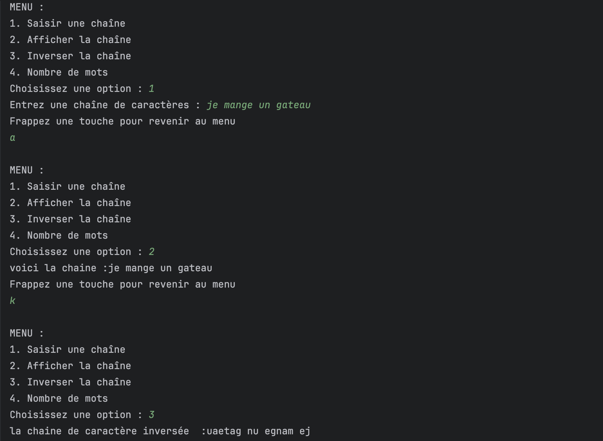

#                        **Report**

                                                               (Tables and Strings)

## Exercice 1 :

##

    
  This program allows the user to enter the number of grades (numberNotes) they want to process, then enter these grades one by one, storing them in an array called `notes` .
  Afterward, the program performs its first operation by sorting the notes array using Arrays.sort(notes) and displays the list of sorted grades. The program also calculates the average of the entered grades by adding all elements of the array, storing the sum in a variable called SommeNotes , and then dividing it by the number of grades to display the average (MoyenneNote).

  

 The program determines the minimum value of the entered grades by initially assuming that the first grade in the array, \`notes\[0\]\`, is the minimum and storing it in \`noteMin\`. It then iterates through the array to check if any grade is lower than the one stored in \`noteMin\`. If so, \`noteMin\` is updated with that value, and the minimum grade is displayed.

To determine the highest grade entered, the process is similar but with \`noteMax\` instead of \`noteMin\`. The program iterates through the array to check if there is a grade higher than the one stored in \`noteMax\`, updating and displaying \`noteMax\` as the maximum value.

The program also allows the user to find how many times a specific grade appears in the \`notes\` array. The user enters the grade to check, which is stored in a variable called \`noteEntered\`. A counter \`cpt\` is initialized to 0, and as the program iterates through the array, it increments \`cpt\` each time an element matches the entered grade. After iterating through all elements, the program displays the counter (\`cpt\`) to the user.

Here is an execution of the code: the user first enters the number of grades, then inputs each grade. The program displays the sorted list of grades, calculates and shows the average of these grades, and identifies both the minimum and maximum grades among them. Finally, it prompts the user to enter a specific grade to see how many times it has occurred in the list.

## 

## 

## 

## Exercice 2 :

## 

##  This program automatically conjugates verbs in the first group. It begins by asking the user to enter a first-group verb, which it stores in a variable (\`verbe\`) and converts to lowercase. The program then checks if the entered verb is indeed a first-group verb by verifying that it has more than two characters and that the last two letters are "er" using an \`if\` condition. If these conditions are met, it extracts the part of the verb without "er," called the stem, and stores it in the variable \`radical\`. The program then adds the pronoun and ending for conjugation. Otherwise, it displays a message informing the user that the entered verb is not a first-group verb.

## 

## 

## 

## 

## 

## Here is the program's execution: as you can see, after the user enters a verb and the program verifies that it is a first-group verb, it displays its conjugation.

## 

## 

##  Exercice 3 :

##  This program presents the user with a list of options, using a \`do-while\` loop to display the available choices and continuously re-display them as long as the user selects a recommended option. It prompts the user to select an option, storing their choice in a variable called \`choix\`. Based on the user's selection, the program will display a prompt, allowing them to enter information to use the functionality of the selected option.

## If the user selects option 1, the program will prompt them to enter a string and store it in a variable named \`chaine\`, defined as a private, static attribute (since this string will be reused if another option is chosen). The \`chaine\` variable is initialized as an empty string.

## 

## If the user selects option 2, the system will check if the \`chaine\` attribute is empty (using \`isEmpty\`); if it is not empty, the program will display the stored string.

 If the user selects option 3, the system checks if \`chaine\` is empty. If it is not, it reverses the string using \`StringBuilder\` (a class that includes a \`reverse\` method for this purpose) and then displays the reversed string.

If the user selects option 4, the system again checks if \`chaine\` is empty. If it is not, the program splits the string into words, using spaces as the delimiter (\`chaine.trim().split(" ")\`), and stores the resulting words in a string array named \`tabch\`. It then returns the length of this array (\`tabch.length\`), representing the word count.

If the user enters an option that exceeds the offered choices, the program displays a message: "Invalid option." To allow the user to choose another option and continue benefiting from the program, they receive a prompt to press any key to return to the menu, pausing until they press a key.  
      
      
As you can see, after selecting option 1, the program prompts me to enter a string, then asks me to press a key to return to the menu. When I press any key, I'm brought back to the menu, where I can choose another function. The chosen function executes, and this sequence repeats as long as the user selects one of the presented options. If an invalid choice is made, an error message is generated.  

Exercice 4 :

This program displays the number of times a letter from the alphabet appears at least once in a string entered by the user. The program starts by prompting the user to enter a string, which is stored in a variable named \`chaine\` and converted to lowercase. It declares an array (\`nb\_occurences\`) containing slots for the 26 letters of the alphabet and uses a loop with a counter (\`occ\`) initialized to 0 to iterate through each letter.

As it traverses the entire string, it increments the counter each time it finds an occurrence of the indexed letter. When it finishes traversing the string, the count is stored in the array at the corresponding index (by subtracting the ASCII code of the letter from that of 'a', since they are sequential with a difference of 1).

Afterward, the program loops through the \`nb\_occurences\` array and starts displaying the letters whose count (\`occ\`) is strictly greater than 0\. 

As you can see, the program prompts the user to enter a string and then displays the number of times each letter has repeated in that string.
